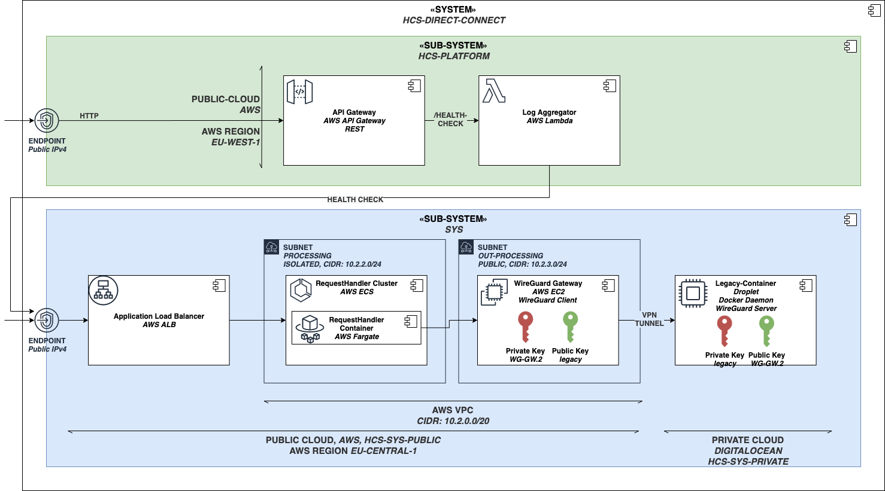
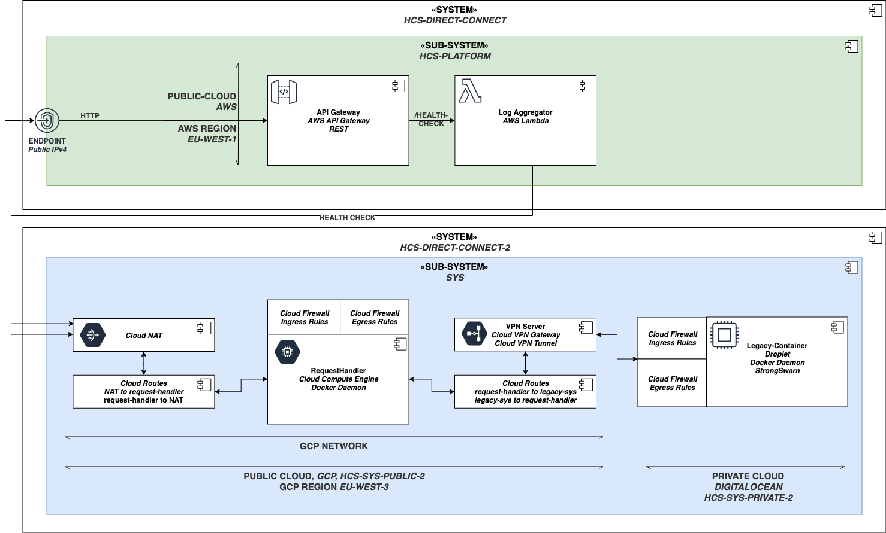
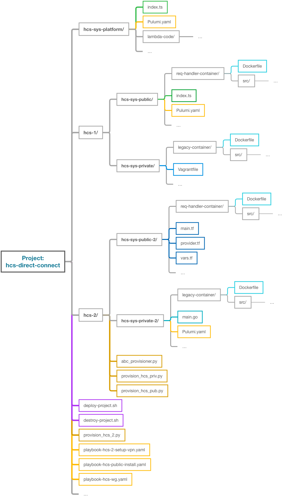

# HCS-DIRECT-CONNECT

This project automates and implements two hybrid cloud systems together with an observer component. Both systems are quite similar and visualized in the next two diagrams.
The implementation for the first diagram is found under the folder './hcs_1' & './hcs-sys-platform'
The implementation for the second diagram is found under the folder './hcs_2' & './hcs-sys-platform'

## Project Structure

The following diagram shows the folder structure of the project. The arrows indicate Pulumi imports. The deployment process is structured from the root 'deployment.sh' file and calls subordinate 'deployment.sh' files to simplify deployment.

## HCS-1, Requirements

- AWS credentails need to get configured first
- DigitalOcean Token need to get set (more info under hcs_1/hcs-sys-private/README.md)
- IaC tools Pulumi, Vagrant must be installed and set up
- Docker needs to get installed and the Docker-Daemon needs to run (docker images get pushed directly to AWS, DO and get build locally first)

## HCS-2, Requirements

- GCP credentails need to get configured first
- DigitalOcean Token need to get set (more info under hcs_2/README.md)
- IaC tools Pulumi, Terraform must be installed and set up
- Docker needs to get installed and the Docker-Daemon needs to run (docker images get pushed directly to GCP, DO and get build locally first)
