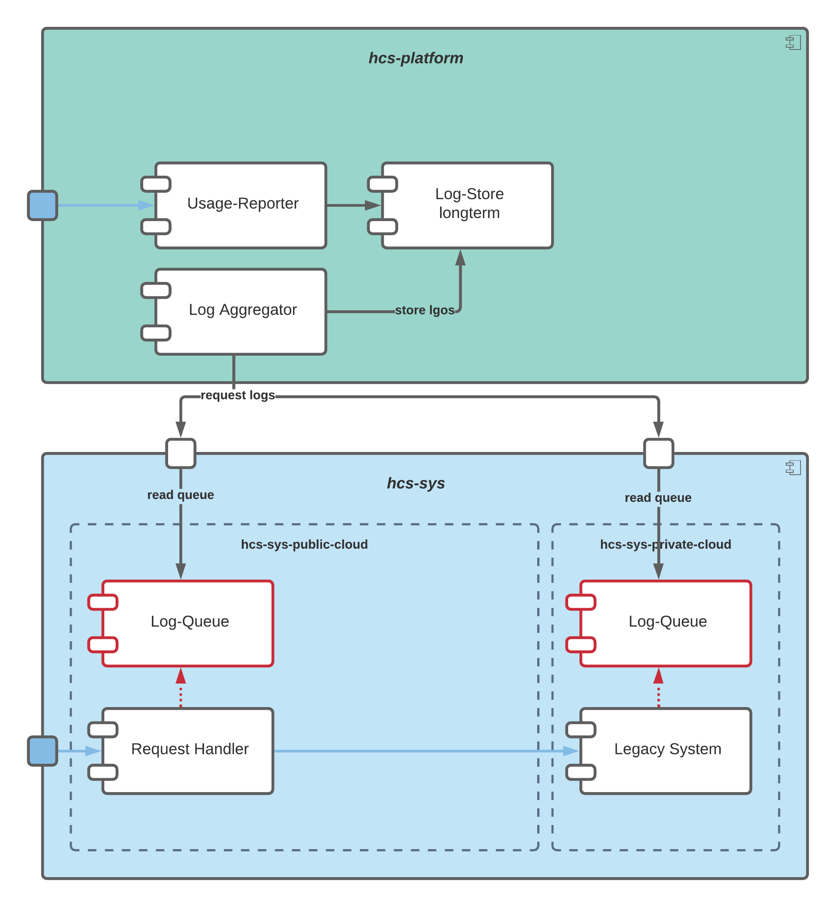
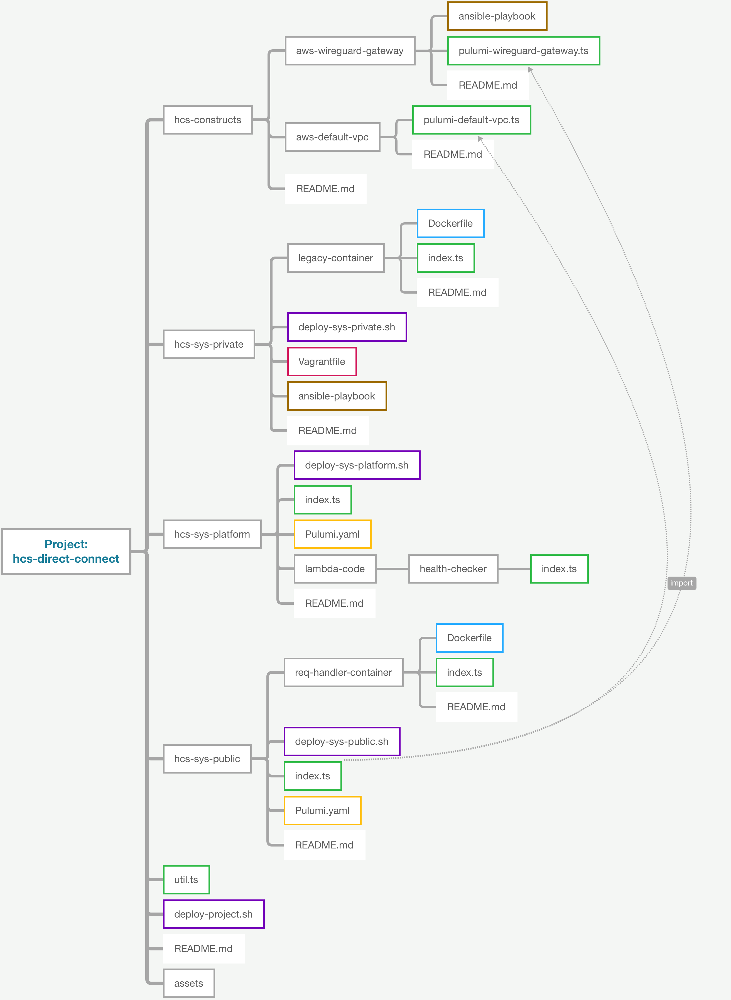

# HCS-DIRECT-CONNECT

This project automates and implements a hybrid cloud system together with an observer component. The diagram below shows an abstract idea of the project.
A more detailed view of the software architecture is highlighted in the next chapters.

## Project Structure

The following diagram shows the folder structure of the project. The arrows indicate Pulumi imports. The deployment process is structured from the root deployment(.sh) file and calls subordinate deployment(.sh) files to simplify deployment.

## Project Architecture

The diagram shown below gives an idea of the software architecture of this project.

## Requirements

- AWS credentails need to get configured first
- DigitalOcean Token need to get set (more info under hcs-sys-private/README.md)
- IaC tools Pulumi, Vagrant must be installed and set up
- Docker needs get installed and the Docker-Daemon needs to run (docker images get pushed directly to AWS and get build locally first)
