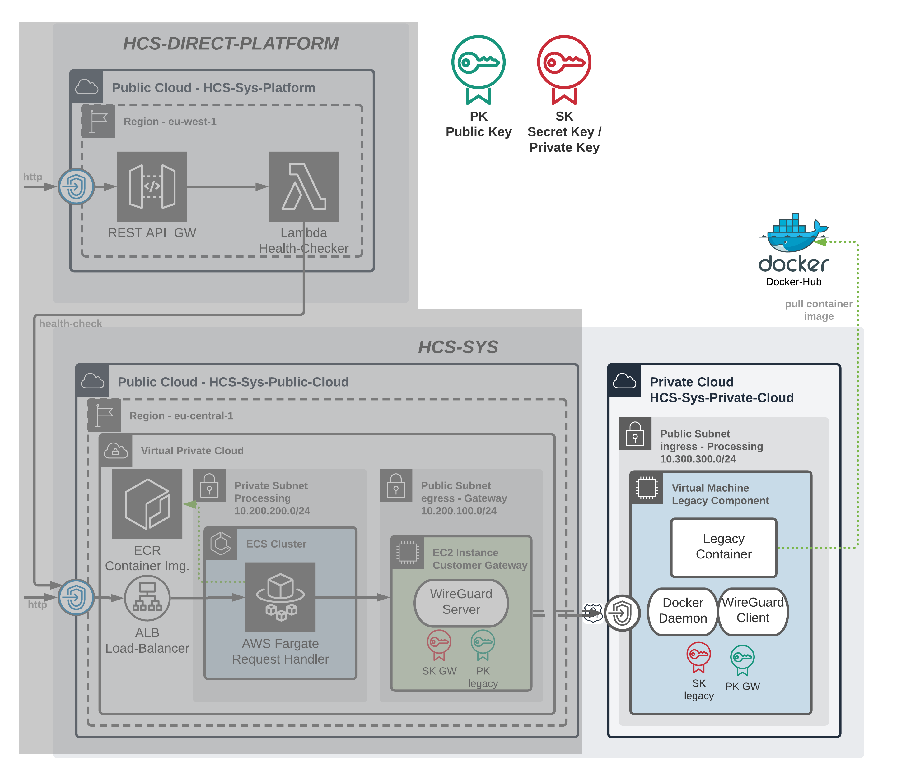

# HCS-SYS-PRIVATE-2

The private cloud environemt is configured in this directory.
The diagram below highlights the area that is being developed.

This project uses digital ocean as private-cloud even if it is public it could also function as private-cloud for a cooperation.



The terraform file `protected_vars.tf` is not getting pushed to version control and needs to be created manually. Example is shown below.

```tf
variable "do_token" {
  description = "Digital Ocean token"
  type        = string
  default     = "AAABBBCCC"
}
variable "pvt_key" {
  description = "SSH Key path"
  type        = string
  default     = "~/.ssh/id_rsa"
}
```

## Terraform Commands

- Check terraform template `terraform plan -out tf_out.json`
- Create resources in digital ocean `terraform apply -out tf_out.json`
- SHH into VM with `ssh -i ~/.ssh/id_rsa` root@0.0.0.0/0
- Destroy resources in digital ocean `terraform destroy`

## Vagrant Provider Note

Installation on OS X may not working due to a SSL certificate problem, and you may need to specify a certificate path explicitly. To do so, run ruby -ropenssl -e "p OpenSSL::X509::DEFAULT_CERT_FILE". Then, add the following environment variable to your .bash_profile script and source it: export SSL_CERT_FILE=/usr/local/etc/openssl/cert.pem.
