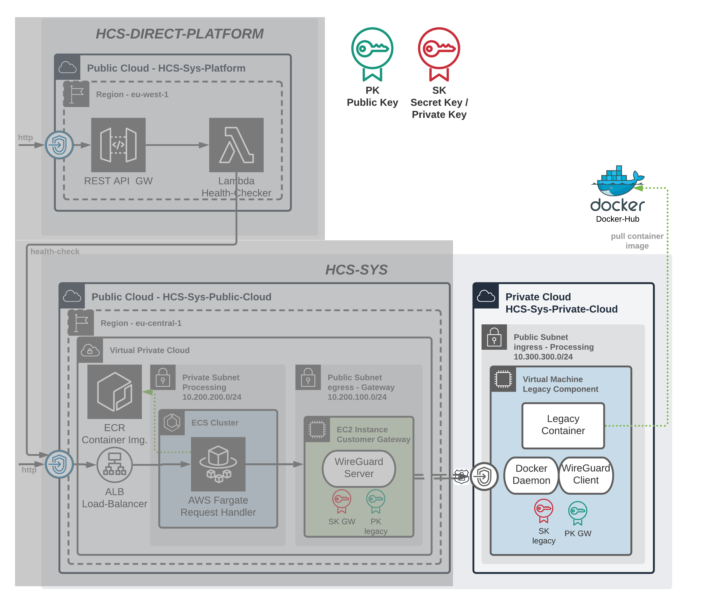

# HCS-SYS-PRIVATE

The private cloud environemt is configured in this directory.
The diagram below highlights the area that is being developed.

This project uses digital ocean as private-cloud even if it is public it could also function as private-cloud for a cooperation.



The vagrant files a `token.yaml` file which needs to get created manually and should the digital ocean token to create a droplet. Example is shown below.

```yaml
digital_ocean_token: "XXXXXXXXXXXXXXX-CREATE-IN-DIGITAL-OCEAN-XXXXXXXXXXXXXXX"
```

## Vagrant Commands:

- Start up VM `vagrant up`
- SHH into VM `vagrant ssh` and use `logout` to get back
- Shut VM down `vagrant destroy`

## Vagrant Provider Note:

Installation on OS X may not working due to a SSL certificate problem, and you may need to specify a certificate path explicitly. To do so, run ruby -ropenssl -e "p OpenSSL::X509::DEFAULT_CERT_FILE". Then, add the following environment variable to your .bash_profile script and source it: export SSL_CERT_FILE=/usr/local/etc/openssl/cert.pem.
