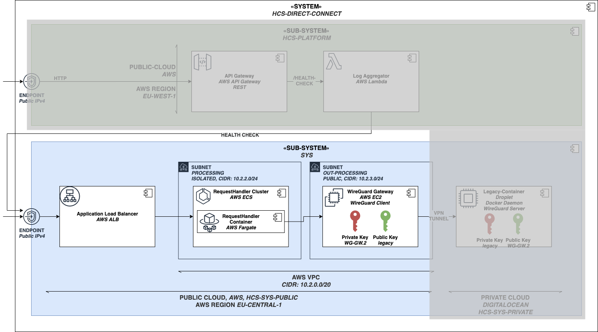

# HCS-SYS-PUBLIC

The public-cloud is configured in this directory and is getting deployed to aws.
The diagram below highlights the area that is being developed.

Run the script `deploy.sh` to deploy the pulumi project to AWS.
The script can get invoked with additional arguments to change the configuration.
For example `sh deploy.sh <...>`

- $1: albClusterReqHandlerPort: number;
- $2: clusterReqHandlerDesiredAmount: number;
- $3: clusterReqHandlerMemory: number;

https://www.digitalocean.com/community/tutorials/how-to-use-ansible-to-automate-initial-server-setup-on-ubuntu-18-04
