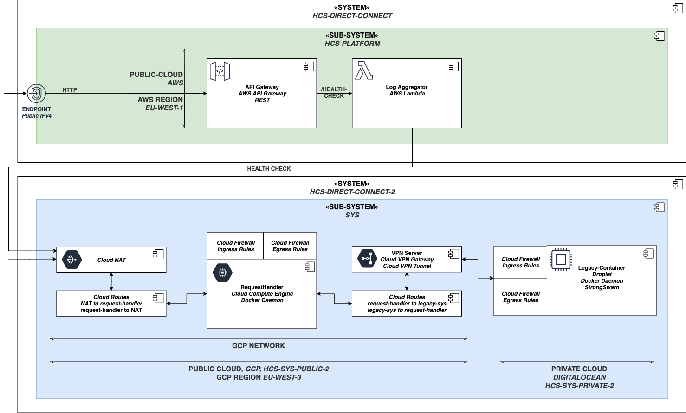
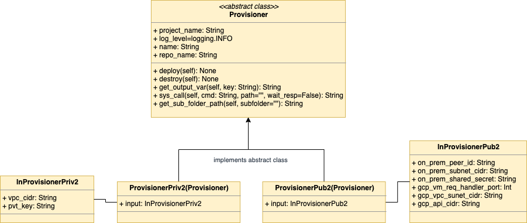

# HCS-DIRECT-CONNECT-2

Under this folder both the public cloud and the private cloud system is configured.
Both systems are part of the HCS-DIRECT-CONNECT-2 hybrid cloud automation strategy system.

- The public cloud is deployed on GCP and uses the IaC tool Pulumi, written in GO.
- The private cloud system is deployed on DigitalOcean and uses the IaC tool Terraform, written in HCL.

The diagram below highlights the system that is getting deployed.

To deploy the system the you can use the 'proivsion_hcs.py' script one directory above this one.
To automate the deployment process python classes have been defined (see 'abc_provision.py', 'provision_hcs_priv.py', 'provision_hcs_pub.py').
The structure is shown in the diagram below.

