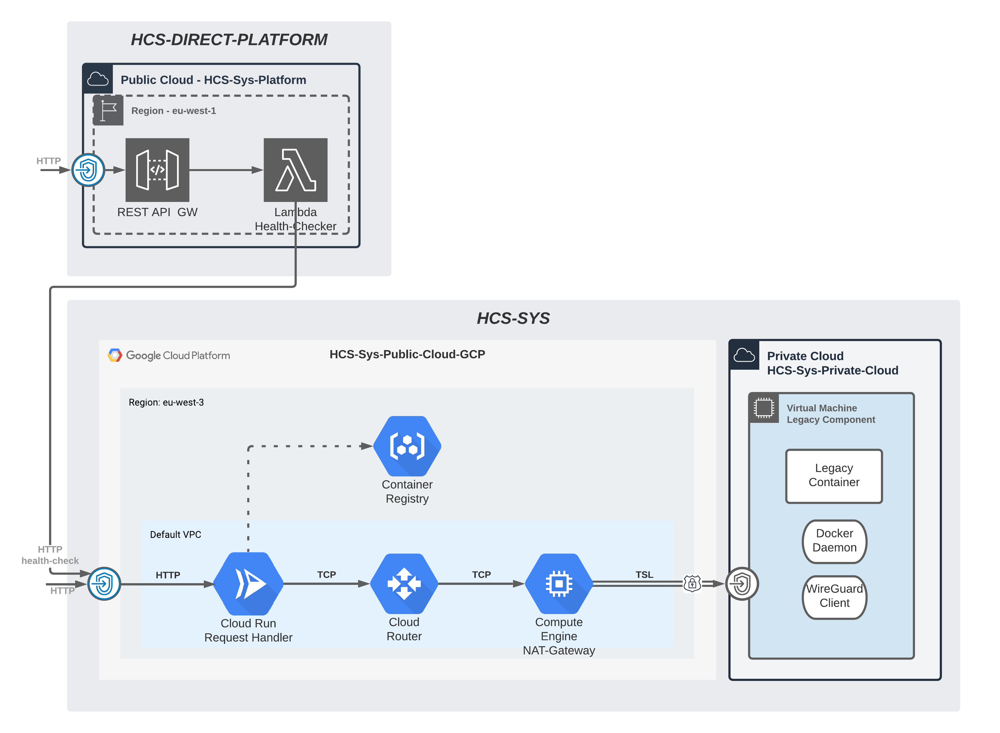

# HCS-SYS-PUBLIC-GCP

The public-cloud is configured in this directory and is getting deployed to gcp.
The diagram below highlights the area that is being developed.

Run the script `deploy.sh` to deploy the pulumi project to GCP.
The script can get invoked with additional arguments to change the configuration.
For example `sh deploy.sh <...>`

- $1: albClusterReqHandlerPort: number;
- $2: clusterReqHandlerDesiredAmount: number;
- $3: clusterReqHandlerMemory: number;
